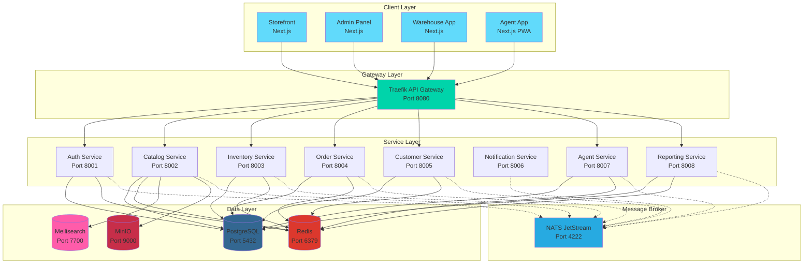
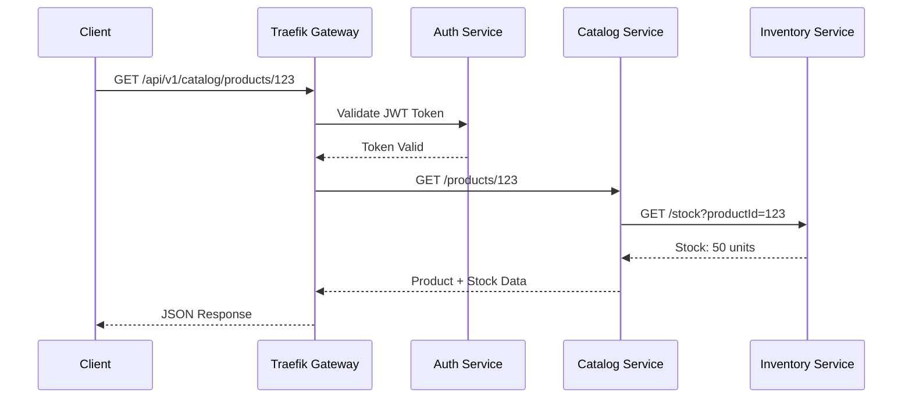
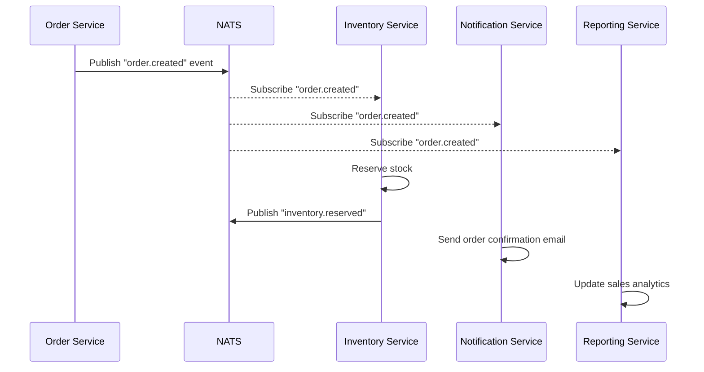
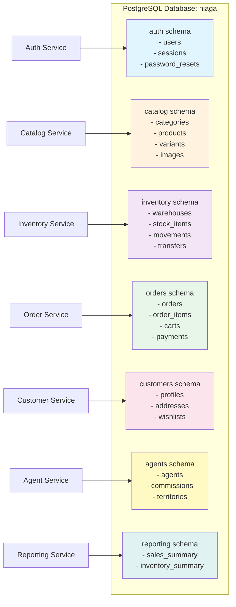
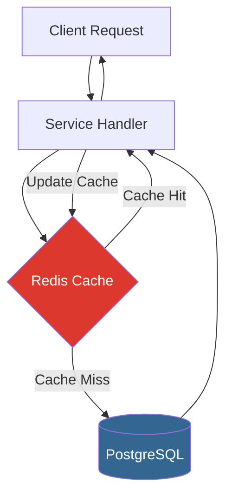
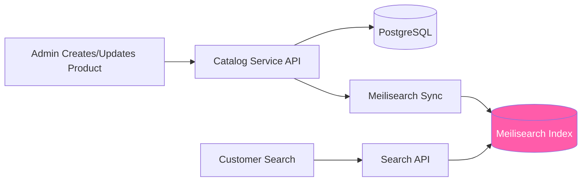
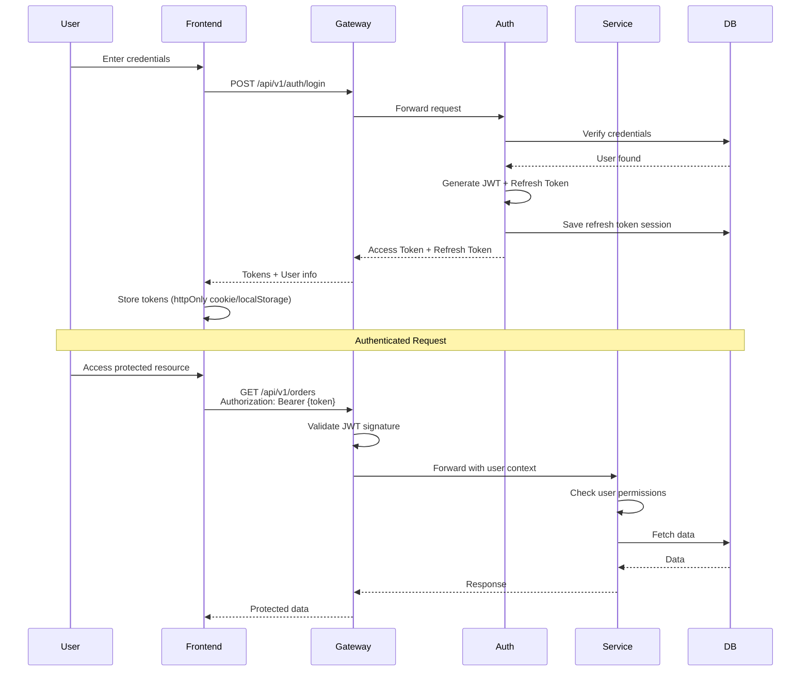
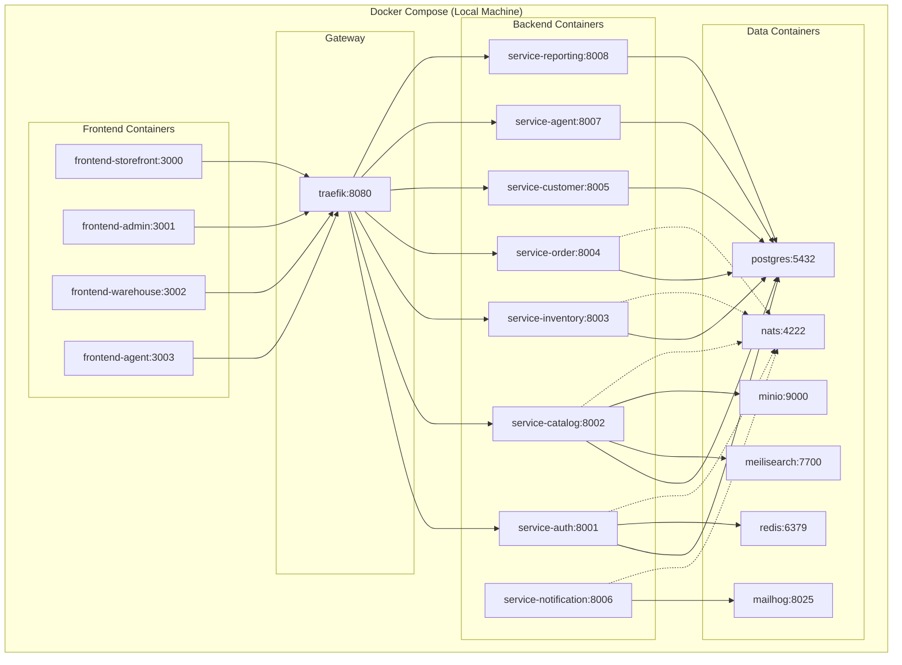
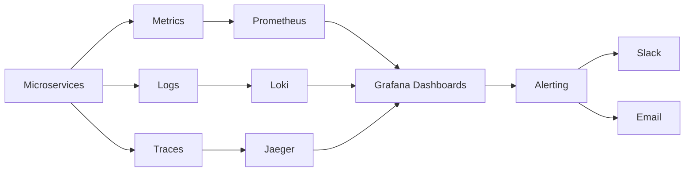

# Niaga Platform Architecture

> **Comprehensive Architecture Documentation** - Deep dive into the microservices architecture, design patterns, and technical decisions

## Table of Contents

- [Overview](#overview)
- [Architecture Principles](#architecture-principles)
- [System Architecture](#system-architecture)
- [Microservices Design](#microservices-design)
- [Service Communication](#service-communication)
- [Data Architecture](#data-architecture)
- [Security Architecture](#security-architecture)
- [Deployment Architecture](#deployment-architecture)
- [Scalability and Performance](#scalability-and-performance)

## Overview

Niaga Platform follows a **microservices architecture** pattern, where the application is decomposed into small, independent services that communicate via well-defined APIs. This architecture provides:

- **Scalability**: Scale individual services independently
- **Resilience**: Failure in one service doesn't bring down the entire system
- **Technology Flexibility**: Each service can use the best technology for its domain
- **Team Autonomy**: Teams can develop and deploy services independently
- **Faster Development**: Parallel development and deployment cycles

## Architecture Principles

### 1. Domain-Driven Design (DDD)

Each microservice is organized around a specific business domain:

- **Auth Domain**: User authentication and authorization
- **Catalog Domain**: Product and category management
- **Inventory Domain**: Stock and warehouse management
- **Order Domain**: Order processing and fulfillment
- **Customer Domain**: Customer relationship management
- **Agent Domain**: Sales agent and commission management
- **Notification Domain**: Multi-channel notifications
- **Reporting Domain**: Analytics and business intelligence

### 2. API-First Design

- RESTful APIs with consistent patterns
- OpenAPI 3.0 specifications for all services
- Versioned endpoints (`/api/v1/`)
- JSON request/response payloads
- Standard HTTP status codes and error responses

### 3. Event-Driven Architecture

- Asynchronous communication via NATS JetStream
- Publish-subscribe pattern for cross-service events
- Event sourcing for audit trails
- Eventual consistency where appropriate

### 4. Single Responsibility

Each service has a single, well-defined responsibility:

- Service owns its data (database per service pattern)
- No direct database access across services
- Clear service boundaries

### 5. Stateless Services

- Services don't maintain client state
- Session data stored in Redis
- Horizontal scaling without session affinity
- JWT tokens for authentication

## System Architecture

### High-Level Architecture Diagram



## Microservices Design

### Service Catalog

| Service          | Port | Responsibilities                                                                    | Dependencies                                          |
| ---------------- | ---- | ----------------------------------------------------------------------------------- | ----------------------------------------------------- |
| **Auth**         | 8001 | User authentication, JWT issuing, session management, role-based access control     | PostgreSQL, Redis                                     |
| **Catalog**      | 8002 | Product CRUD, category management, variant handling, image uploads, search indexing | PostgreSQL, Redis, Meilisearch, MinIO                 |
| **Inventory**    | 8003 | Stock tracking, warehouse management, stock transfers, movement logging             | PostgreSQL, Redis                                     |
| **Order**        | 8004 | Cart management, order processing, checkout flow, payment integration               | PostgreSQL, Redis, Auth, Catalog, Inventory, Customer |
| **Customer**     | 8005 | Customer profiles, address management, wishlist, order history                      | PostgreSQL, Redis                                     |
| **Notification** | 8006 | Email, SMS, push notifications, template management                                 | Redis, SMTP (MailHog dev)                             |
| **Agent**        | 8007 | Sales agent management, commission calculation, territory assignment                | PostgreSQL, Redis                                     |
| **Reporting**    | 8008 | Sales analytics, inventory reports, customer insights, dashboards                   | PostgreSQL, Redis                                     |

### Service Structure (Go Services)

All Go services follow a consistent structure:

```
service-*/
├── cmd/
│   └── server/
│       └── main.go              # Entry point
├── internal/
│   ├── config/                  # Configuration management
│   ├── models/                  # Domain models (GORM)
│   ├── repository/              # Data access layer
│   ├── handlers/                # HTTP handlers (controllers)
│   ├── services/                # Business logic
│   └── middleware/              # HTTP middleware
├── migrations/                  # Database migrations
├── Dockerfile
├── go.mod
└── README.md
```

**Layers**:

1. **Handler Layer**: HTTP request/response handling, validation
2. **Service Layer**: Business logic, orchestration
3. **Repository Layer**: Data persistence, database queries
4. **Model Layer**: Domain entities and DTOs

## Service Communication

### Synchronous Communication (HTTP/REST)

Services communicate via RESTful APIs through the API Gateway:



**Patterns**:

- All external requests go through Traefik
- Services can call each other directly (service-to-service)
- JWT validation at gateway or service level
- Retry logic with exponential backoff
- Circuit breaker for resilience

### Asynchronous Communication (NATS)

Event-driven communication for loosely coupled services:



**Event Types**:

- `order.created`, `order.updated`, `order.cancelled`
- `product.created`, `product.updated`, `product.deleted`
- `inventory.updated`, `inventory.reserved`, `inventory.released`
- `user.registered`, `user.login`
- `payment.processed`, `payment.failed`

**Benefits**:

- **Decoupling**: Services don't need to know about each other
- **Scalability**: Async processing for long-running tasks
- **Reliability**: NATS JetStream provides persistence and replay
- **Extensibility**: Easy to add new subscribers

## Data Architecture

### Database-Per-Service Pattern

Each service owns its database schema:



**Advantages**:

- **Isolation**: Schema changes don't affect other services
- **Technology Freedom**: Each service can use different database technologies
- **Scalability**: Scale databases independently
- **Team Autonomy**: Teams manage their own data

**Challenges & Solutions**:

- **Data Consistency**: Use NATS events for eventual consistency
- **Joins Across Services**: Implement API composition or CQRS
- **Transactions**: Use Saga pattern for distributed transactions

### Caching Strategy (Redis)



**Caching Patterns**:

- **Cache-Aside**: Check cache first, then database
- **Write-Through**: Update cache when writing to database
- **TTL Strategy**: Different expiration times per data type
  - Products: 1 hour
  - Categories: 12 hours
  - User sessions: 15 minutes (JWT expiry)
  - Stock levels: 5 minutes

### Search Architecture (Meilisearch)



**Indexed Fields**:

- Product name, description, tags
- Category names
- SKU, barcode
- Variants (size, color, etc.)

**Search Features**:

- Typo tolerance
- Faceted search (filters by category, price, attributes)
- Autocomplete suggestions
- Ranking by relevance, popularity, or price

## Security Architecture

### Authentication Flow



### JWT Structure

```json
{
  "header": {
    "alg": "HS256",
    "typ": "JWT"
  },
  "payload": {
    "sub": "user-uuid",
    "email": "user@example.com",
    "role": "customer",
    "exp": 1234567890,
    "iat": 1234567000
  }
}
```

### Authorization Levels

1. **Public**: No authentication required (product listing, search)
2. **Customer**: Requires authentication (cart, orders, profile)
3. **Agent**: Requires authentication + agent role
4. **Warehouse**: Requires authentication + warehouse role
5. **Admin**: Requires authentication + admin role

### API Gateway Security

Traefik provides:

- **SSL/TLS Termination**: HTTPS for all external traffic
- **Rate Limiting**: Prevent abuse and DDoS
- **IP Whitelisting**: Restrict admin endpoints
- **CORS Configuration**: Control cross-origin requests
- **Request Size Limits**: Prevent payload attacks

## Deployment Architecture

### Development Environment



### Production Environment (Example)

```mermaid
graph TB
    subgraph "CDN / Edge"
        CF[Cloudflare / CDN]
    end

    subgraph "Frontend Hosting (Netlify)"
        SF[Storefront]
        AP[Admin Panel]
        WH[Warehouse App]
        AG[Agent App]
    end

    subgraph "Backend Hosting (Railway / VPS)"
        LB[Load Balancer]

        subgraph "Service Cluster"
            AUTH[Auth Service x2]
            CAT[Catalog Service x3]
            INV[Inventory Service x2]
            ORD[Order Service x3]
            CUST[Customer Service x2]
            NOT[Notification Service x2]
            AGENT[Agent Service x2]
            REP[Reporting Service x2]
        end

        GW[API Gateway - Traefik]
    end

    subgraph "Managed Databases"
        PG[PostgreSQL (Managed)]
        RD[Redis (Managed)]
        MS[Meilisearch Cloud]
        NATS[NATS Cloud / Self-hosted]
    end

    subgraph "Object Storage"
        S3[S3 / MinIO / Cloudflare R2]
    end

    Users --> CF
    CF --> SF
    CF --> AP
    CF --> WH
    CF --> AG

    SF --> GW
    AP --> GW
    WH --> GW
    AG --> GW

    GW --> LB
    LB --> AUTH
    LB --> CAT
    LB --> INV
    LB --> ORD
    LB --> CUST
    LB --> NOT
    LB --> AGENT
    LB --> REP

    AUTH --> PG
    CAT --> PG
    CAT --> MS
    CAT --> S3
    INV --> PG
    ORD --> PG

    AUTH -.-> NATS
    CAT -.-> NATS
    INV -.-> NATS
    ORD -.-> NATS
```

## Scalability and Performance

### Horizontal Scaling

All services are **stateless** and can be scaled horizontally:

```bash
# Docker Swarm example
docker service scale niaga-catalog=5
docker service scale niaga-order=3
```

### Performance Optimization

1. **Database Optimization**

   - Proper indexing on frequently queried fields
   - Connection pooling (GORM configuration)
   - Read replicas for reporting service

2. **Caching Strategy**

   - Redis for frequently accessed data
   - CDN for static assets
   - Browser caching headers

3. **Async Processing**

   - NATS for background jobs
   - Email sending, report generation
   - Inventory updates

4. **API Optimization**
   - Pagination for list endpoints
   - Field selection (sparse fieldsets)
   - HTTP/2 support
   - gzip compression

### Monitoring and Observability



**Key Metrics**:

- Request rate, latency, error rate (RED method)
- CPU, memory, disk usage
- Database connection pool stats
- Cache hit/miss ratio
- Queue depth (NATS)

## Design Patterns Used

### Backend Patterns

1. **Repository Pattern**: Data access abstraction
2. **Service Layer Pattern**: Business logic separation
3. **Dependency Injection**: Loose coupling
4. **Middleware Pattern**: Cross-cutting concerns (auth, logging)
5. **Circuit Breaker**: Resilient service communication
6. **Saga Pattern**: Distributed transactions
7. **CQRS**: Command Query Responsibility Segregation (reporting service)

### Frontend Patterns

1. **Atomic Design**: Component hierarchy (atoms, molecules, organisms)
2. **Container/Presenter**: Smart and dumb components
3. **Custom Hooks**: Reusable logic
4. **State Management**: Zustand for global state
5. **API Layer**: Centralized API calls
6. **Error Boundaries**: Graceful error handling

## Technology Decisions

### Why Go for Backend?

- **Performance**: Fast execution, low memory footprint
- **Concurrency**: Goroutines for handling many requests
- **Simplicity**: Easy to learn and maintain
- **Tooling**: Excellent standard library and ecosystem
- **Deployment**: Single binary, no runtime dependencies

### Why Next.js for Frontend?

- **SSR/SSG**: Great for SEO and performance
- **App Router**: Modern React patterns
- **TypeScript**: Type safety
- **Developer Experience**: Hot reload, easy deployment
- **Ecosystem**: Large community and plugins

### Why NATS over RabbitMQ/Kafka?

- **Simplicity**: Easy setup and operation
- **Performance**: Low latency, high throughput
- **JetStream**: Built-in persistence and replay
- **Cloud-Native**: Perfect for microservices
- **Lightweight**: Small resource footprint

### Why Meilisearch over Elasticsearch?

- **Simplicity**: Minimal configuration
- **Speed**: Blazing fast search results
- **Developer-Friendly**: Great API and documentation
- **Typo Tolerance**: Built-in without configuration
- **Resource Efficient**: Lower memory usage

## Future Enhancements

- [ ] GraphQL API gateway (Apollo Federation)
- [ ] gRPC for internal service communication
- [ ] Kubernetes deployment configurations
- [ ] Service mesh (Istio/Linkerd)
- [ ] Distributed tracing (OpenTelemetry)
- [ ] Real-time features (WebSockets/SSE)
- [ ] Multi-tenancy support
- [ ] Advanced caching (Varnish)

## Related Documentation

- [Database Schema](DATABASE-SCHEMA.md) - Detailed database design
- [API Documentation](api/README.md) - RESTful API reference
- [Deployment Guide](DEPLOYMENT.md) - Deployment strategies
- [Troubleshooting](TROUBLESHOOTING.md) - Common issues

---

**Last Updated**: 2025-12-02  
**Version**: 1.0.0
