# Niaga Platform Database Schema

> **Complete Database Documentation** - Comprehensive guide to the PostgreSQL database design, schemas, tables, and relationships

## Table of Contents

- [Overview](#overview)
- [Database Design Principles](#database-design-principles)
- [Schemas](#schemas)
- [Entity Relationship Diagrams](#entity-relationship-diagrams)
- [Schema Details](#schema-details)
  - [Auth Schema](#auth-schema)
  - [Catalog Schema](#catalog-schema)
  - [Inventory Schema](#inventory-schema)
  - [Sales Schema](#sales-schema)
  - [CRM Schema](#crm-schema)
  - [Agent Schema](#agent-schema)
- [Indexes and Performance](#indexes-and-performance)
- [Triggers and Functions](#triggers-and-functions)
- [Migration Strategy](#migration-strategy)

## Overview

The Niaga Platform uses **PostgreSQL 16+** as its primary database. The database is organized into **six distinct schemas**, each owned by a specific microservice following the database-per-service pattern.

### Database Information

- **Database Name**: `niaga`
- **RDBMS**: PostgreSQL 16+
- **ORM**: GORM (Go services)
- **Total Schemas**: 6
- **Total Tables**: 40+
- **Character Set**: UTF-8

### Connection Details (Development)

```
Host: localhost
Port: 5432
Database: niaga
User: niaga
Password: niaga_dev_password
SSL Mode: disable (dev), require (prod)
```

## Database Design Principles

### 1. Schema-Based Service Isolation

Each microservice has its own schema within the same database:

- **Logical separation** of data by service
- **Performance benefits** over separate databases
- **Referential integrity** where needed (e.g., users)
- **Easier backup and deployment** management

### 2. UUID Primary Keys

All tables use `UUID` as primary keys:

```sql
id UUID PRIMARY KEY DEFAULT gen_random_uuid()
```

**Benefits**:

- Globally unique identifiers
- No collision in distributed systems
- Better security (non-sequential IDs)
- Easy merging of data from multiple sources

### 3. Soft Deletes

Critical tables use soft deletes via `deleted_at` column:

- Preserves data for audit trails
- Enables data recovery
- Maintains referential integrity

### 4. Timestamps

All entities have:

- `created_at TIMESTAMP DEFAULT CURRENT_TIMESTAMP`
- `updated_at TIMESTAMP DEFAULT CURRENT_TIMESTAMP`
- Automatic update trigger on `updated_at`

### 5. JSONB for Flexibility

Use JSONB for semi-structured data:

- Product attributes
- Order addresses
- Payment metadata
- Indexed and queryable

## Schemas

| Schema      | Owner Service     | Tables | Description                                        |
| ----------- | ----------------- | ------ | -------------------------------------------------- |
| `auth`      | service-auth      | 3      | User authentication, sessions, password resets     |
| `catalog`   | service-catalog   | 14     | Products, categories, variants, images, attributes |
| `inventory` | service-inventory | 5      | Warehouses, stock items, movements, transfers      |
| `sales`     | service-order     | 11     | Orders, carts, payments, shipping, coupons         |
| `crm`       | service-customer  | 3      | Customer profiles, addresses, wishlists            |
| `agent`     | service-agent     | 4      | Agent management, commissions, payouts, targets    |

## Entity Relationship Diagrams

### Complete System ERD


### Auth Schema ERD


### Catalog Schema ERD


### Inventory Schema ERD


### Sales Schema ERD

```mermaid
erDiagram
    CARTS {
        uuid id PK
        uuid user_id FK
        varchar session_id
        varchar coupon_code
        decimal coupon_discount
        text notes
        timestamp expires_at
        timestamp created_at
        timestamp updated_at
    }

    CART_ITEMS {
        uuid id PK
        uuid cart_id FK
        uuid product_id
        uuid variant_id
        int quantity
        decimal unit_price
        timestamp created_at
        timestamp updated_at
    }

    ORDERS {
        uuid id PK
        varchar order_number UK
        uuid user_id FK
        uuid agent_id FK
        varchar status
        decimal subtotal
        decimal shipping_cost
        decimal tax_amount
        decimal discount_amount
        decimal total
        varchar coupon_code
        decimal coupon_discount
        varchar shipping_method
        jsonb shipping_address
        jsonb billing_address
        uuid warehouse_id FK
        varchar tracking_number
        varchar tracking_url
        timestamp shipped_at
        timestamp delivered_at
        text customer_notes
        text admin_notes
        timestamp confirmed_at
        timestamp cancelled_at
        text cancellation_reason
        timestamp created_at
        timestamp updated_at
    }

    ORDER_ITEMS {
        uuid id PK
        uuid order_id FK
        uuid product_id
        uuid variant_id
        varchar sku
        varchar name
        varchar variant_name
        int quantity
        decimal unit_price
        decimal total_price
        timestamp created_at
    }

    ORDER_STATUS_HISTORY {
        uuid id PK
        uuid order_id FK
        varchar status
        text notes
        uuid created_by
        timestamp created_at
    }

    PAYMENTS {
        uuid id PK
        uuid order_id FK
        varchar payment_method
        varchar payment_provider
        varchar transaction_id
        decimal amount
        varchar status
        timestamp paid_at
        jsonb metadata
        timestamp created_at
        timestamp updated_at
    }

    COUPONS {
        uuid id PK
        varchar code UK
        text description
        varchar type
        decimal value
        decimal min_order_amount
        decimal max_discount
        int usage_limit
        int used_count
        int per_customer_limit
        timestamp starts_at
        timestamp expires_at
        boolean is_active
        timestamp created_at
    }

    SHIPPING_METHODS {
        uuid id PK
        varchar code UK
        varchar name
        text description
        varchar provider
        decimal base_cost
        decimal free_shipping_threshold
        int estimated_days_min
        int estimated_days_max
        boolean is_active
        int sort_order
        timestamp created_at
    }

    CARTS ||--o{ CART_ITEMS : "contains"
    ORDERS ||--o{ ORDER_ITEMS : "contains"
    ORDERS ||--o{ ORDER_STATUS_HISTORY : "tracks"
    ORDERS ||--o{ PAYMENTS : "has"
```



### CRM Schema ERD


### Agent Schema ERD


## Schema Details

### Auth Schema

**Purpose**: User authentication, authorization, and session management

#### Tables

##### `auth.users`

Primary user entity for all platform users (customers, admins, agents, warehouse staff).

**Key Fields**:

- `id` - UUID primary key
- `email` - Unique email address
- `password_hash` - bcrypt hashed password
- `role` - User role: `customer`, `admin`, `agent`, `warehouse`, `super_admin`
- `status` - Account status: `active`, `inactive`, `suspended`

**Relationships**:

- Has many `sessions`
- Has many `password_resets`
- Has one `customer_profile` (CRM)
- Has one `agent_profile` (Agent)
- Has many `orders` (Sales)
- Has many `addresses` (CRM)

##### `auth.sessions`

JWT refresh token storage for authenticated sessions.

**Key Fields**:

- `refresh_token` - Unique refresh token
- `expires_at` - Token expiration timestamp
- `user_agent` - Client user agent string
- `ip_address` - Client IP address

##### `auth.password_resets`

Password reset tokens with expiration.

**Key Fields**:

- `token` - Unique reset token
- `expires_at` - Token expiration (typically 1 hour)
- `used_at` - Timestamp when token was used (prevents reuse)

---

### Catalog Schema

**Purpose**: Product catalog management, categories, variants, and attributes

#### Key Tables

##### `catalog.products`

Main product entity.

**Key Fields**:

- `sku` - Stock Keeping Unit (unique)
- `slug` - URL-friendly product identifier
- `base_price` - Regular price
- `compare_price` - Original price (for showing discounts)
- `cost_price` - Cost to business (for profit calculation)
- `has_variants` - Whether product has variants (size, color, etc.)
- `is_featured` - Featured on homepage

**Indexes**:

- `slug` (unique), `sku` (unique), `is_active`, `is_featured`

##### `catalog.categories`

Hierarchical category structure (unlimited depth).

**Key Fields**:

- `parent_id` - Self-referencing FK for hierarchy
- `slug` - URL-friendly identifier
- `sort_order` - Display order

**Hierarchy Example**:

```
Fashion (parent_id: NULL)
  ├─ Women's Clothing (parent_id: Fashion ID)
  │   ├─ Dresses (parent_id: Women's Clothing ID)
  │   └─ Tops (parent_id: Women's Clothing ID)
  └─ Men's Clothing (parent_id: Fashion ID)
```

##### `catalog.product_variants`

Product variations (e.g., "Red T-Shirt - Size L").

**Key Fields**:

- `sku` - Unique SKU for this variant
- `price` - Variant-specific price (optional, inherits from product if NULL)
- `weight` - Variant-specific weight

**Relationships**:

- Belongs to one `product`
- Has many `variant_option_values` through junction table

##### `catalog.attributes`

Product attributes for filtering (material, brand, style, etc.).

**Different from Variants**:

- Attributes: For filtering/searching (color available in "Red, Blue, Green")
- Variants: Actual sellable SKUs ("Red - Small", "Blue - Medium")

---

### Inventory Schema

**Purpose**: Multi-warehouse stock management

#### Key Tables

##### `inventory.warehouses`

Physical or virtual storage locations.

**Key Fields**:

- `code` - Unique warehouse code (e.g., "WH-HQ", "STORE-KL")
- `type` - `warehouse`, `store`, `virtual`
- `is_pickup_location` - Can customers pickup from here?
- `priority` - Fulfillment priority

##### `inventory.stock_items`

Stock levels per warehouse per product/variant.

**Key Fields**:

- `quantity` - Available stock
- `reserved_quantity` - Stock reserved for pending orders
- `reorder_point` - Trigger for reorder notification
- `bin_location` - Physical location in warehouse

**Unique Constraint**: `(warehouse_id, product_id, variant_id)`

##### `inventory.stock_movements`

Audit trail of all stock changes.

**Movement Types**:

- `receive` - Stock received from supplier
- `sale` - Stock sold to customer
- `adjustment` - Manual stock adjustment
- `transfer_in` - Received from another warehouse
- `transfer_out` - Sent to another warehouse
- `return` - Customer return
- `damage` - Damaged stock write-off

##### `inventory.stock_transfers`

Inter-warehouse stock transfers.

**Workflow**:

1. `pending` - Transfer created
2. `approved` - Management approved
3. `in_transit` - Items shipped
4. `completed` - Items received
5. `cancelled` - Transfer cancelled

---

### Sales Schema

**Purpose**: Order processing, cart management, payments

#### Key Tables

##### `sales.orders`

Main order entity.

**Key Fields**:

- `order_number` - Auto-generated unique order number (ORD-YYYYMMDD-NNNNNN)
- `status` - Order lifecycle status
- Pricing fields: `subtotal`, `shipping_cost`, `tax_amount`, `discount_amount`, `total`
- `shipping_address`, `billing_address` - JSONB for flexibility
- `tracking_number` - Shipping tracking number
- `agent_id` - Sales agent who processed order (optional)

**Order Statuses**:

1. `pending` - Order placed, awaiting confirmation
2. `confirmed` - Order confirmed, ready to process
3. `processing` - Being prepared
4. `packed` - Packed and ready to ship
5. `shipped` - Dispatched to customer
6. `delivered` - Delivered to customer
7. `cancelled` - Order cancelled
8. `refunded` - Payment refunded

##### `sales.carts`

Shopping cart for both guest and logged-in users.

**Key Fields**:

- `user_id` - FK to user (NULL for guest carts)
- `session_id` - For guest cart persistence
- `expires_at` - Cart expiration (e.g., 30 days)

##### `sales.payments`

Payment records for orders.

**Key Fields**:

- `payment_method` - cod, online_banking, credit_card, ewallet
- `payment_provider` - stripe, ipay88, senangpay, etc.
- `transaction_id` - Provider's transaction ID
- `status` - pending, processing, completed, failed, refunded

##### `sales.coupons`

Discount coupon codes.

**Key Fields**:

- `code` - Unique coupon code
- `type` - `percentage` or `fixed`
- `value` - Discount value
- `usage_limit` - Max total uses
- `per_customer_limit` - Max uses per customer

---

### CRM Schema

**Purpose**: Customer relationship management

#### Key Tables

##### `crm.customer_profiles`

Extended customer information.

**Key Fields**:

- `user_id` - One-to-one with `auth.users`
- `customer_group` - regular, vip, wholesale, agent
- `total_orders` - Calculated field (updated via trigger/event)
- `total_spent` - Lifetime value
- `tags` - Array of tags for segmentation

##### `crm.addresses`

Customer delivery/billing addresses.

**Key Fields**:

- `is_default` - Default shipping address
- `label` - e.g., "Home", "Office"
- Full Malaysian address fields

##### `crm.wishlists`

Saved items for later.

---

### Agent Schema

**Purpose**: Sales agent and commission management

#### Key Tables

##### `agent.agents`

Agent profiles.

**Key Fields**:

- `agent_code` - Unique agent code
- `parent_agent_id` - For multi-level marketing (MLM) structure
- `tier` - bronze, silver, gold, platinum, diamond
- `commission_rate` - Default commission percentage

##### `agent.commissions`

Commission records per order.

**Key Fields**:

- `order_id` - FK to order
- `commission_rate` - Rate used (may differ from default)
- `commission_amount` - Calculated commission
- `status` - pending, approved, paid, cancelled

##### `agent.payouts`

Grouped payout to agents.

**Key Fields**:

- `payout_number` - Unique payout reference
- `amount` - Total payout amount
- `bank_account` - Agent's bank details
- `status` - pending, processing, completed, failed

---

## Indexes and Performance

### Critical Indexes

```sql
-- Auth
CREATE INDEX idx_users_email ON auth.users(email);
CREATE INDEX idx_sessions_refresh_token ON auth.sessions(refresh_token);

-- Catalog
CREATE INDEX idx_products_slug ON catalog.products(slug);
CREATE INDEX idx_products_sku ON catalog.products(sku);
CREATE INDEX idx_products_is_active_is_featured ON catalog.products(is_active, is_featured);

-- Inventory
CREATE INDEX idx_stock_items_warehouse_product ON inventory.stock_items(warehouse_id, product_id);

-- Sales
CREATE INDEX idx_orders_user_status ON sales.orders(user_id, status);
CREATE INDEX idx_orders_created_at ON sales.orders(created_at DESC);
CREATE INDEX idx_order_items_order_id ON sales.order_items(order_id);

-- CRM
CREATE INDEX idx_addresses_user_id_is_default ON crm.addresses(user_id, is_default);
```

### Query Optimization Tips

1. **Use EXPLAIN ANALYZE** to check query plans
2. **Avoid N+1 queries** - use GORM Preload
3. **Use partial indexes** for filtered queries
4. **JSONB indexes** for frequently queried JSON fields:
   ```sql
   CREATE INDEX idx_orders_shipping_city ON sales.orders((shipping_address->>'city'));
   ```

---

## Triggers and Functions

### Auto-Update Timestamp

```sql
CREATE OR REPLACE FUNCTION update_updated_at_column()
RETURNS TRIGGER AS $$
BEGIN
    NEW.updated_at = CURRENT_TIMESTAMP;
    RETURN NEW;
END;
$$ language 'plpgsql';

-- Applied to all tables with updated_at column
```

### Auto-Generate Order Number

```sql
CREATE OR REPLACE FUNCTION generate_order_number()
RETURNS TRIGGER AS $$
BEGIN
    NEW.order_number = 'ORD-' || TO_CHAR(CURRENT_DATE, 'YYYYMMDD') || '-' ||
                       LPAD(NEXTVAL('sales.order_number_seq')::TEXT, 6, '0');
    RETURN NEW;
END;
$$ language 'plpgsql';

-- Example: ORD-20251202-000001
```

---

## Migration Strategy

### Development

Services auto-migrate on startup using GORM AutoMigrate:

```go
db.AutoMigrate(&models.Product{}, &models.Category{}, ...)
```

### Production

Use migration files:

```
infra-database/migrations/
├── 001_create_auth_schema.up.sql
├── 001_create_auth_schema.down.sql
├── 002_create_catalog_schema.up.sql
├── 002_create_catalog_schema.down.sql
└── ...
```

**Migration Tools**:

- golang-migrate/migrate
- Manual SQL execution for complex migrations

### Best Practices

1. **Always create down migrations** for rollback
2. **Test migrations on staging** before production
3. **Backup database** before major migrations
4. **Avoid breaking changes** - use gradual migrations
5. **Version control** all migration files

---

## Backup and Recovery

### Backup Strategy

```bash
# Full database backup
pg_dump -U niaga -d niaga > niaga_backup_$(date +%Y%m%d).sql

# Schema-only backup
pg_dump -U niaga -d niaga --schema-only > niaga_schema.sql

# Specific schema backup
pg_dump -U niaga -d niaga -n catalog > catalog_backup.sql
```

### Restore

```bash
# Full restore
psql -U niaga -d niaga < niaga_backup_20251202.sql

# Specific schema restore
psql -U niaga -d niaga < catalog_backup.sql
```

---

## Related Documentation

- [Architecture](ARCHITECTURE.md) - System architecture overview
- [API Documentation](api/README.md) - API endpoint reference
- [Service Documentation](../README.md#documentation) - Individual service docs
- [Deployment Guide](DEPLOYMENT.md) - Production deployment

---

**Last Updated**: 2025-12-02  
**Database Version**: 1.0.0  
**PostgreSQL Version**: 16+
